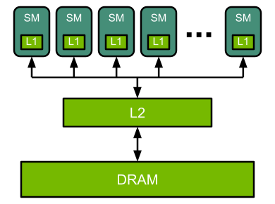

# cublas baseline: 29.6072 ms

# 从non-coalesced memory access到coalesced memory access: 279.448395 ms

在gpu上，一个线程块会被划分到多个warp上来执行，一般一个warp上有32个worker，那么各个warp会按顺序取0-31，32-63等等编号的线程。在2D的线程块中，线程编号是这样计算的`threadID = threadIdx.x + threadIdx.y * blockDim.x`，这意味着warp在线程块中会按行取线程，即row-major。

按照naive矩阵乘的方法，每个线程中

```cpp
row = blockIdx.x * blockDim.x + threadIdx.x;
col = blockIdx.y * blockDim.y + threadIdx.y;
```

横x竖y符合直觉。但是在计算矩阵时如下读AB矩阵、写C矩阵操作中

```cpp
sum += A[row * K + k] * B[col + k * N];
C[row * N + col] = alpha * s + beta * C[row * N + col];
```

可以发现A和C矩阵的访问都涉及到了`row*行宽+col`，说明一个warp中连续编号的threads，在此处读写时都要跨行或者说按列取，即row-major的workers并行地取了col-major的数据，而不能实现连续的threads取连续的内存。

- 此处可能会误解连续取内存是每个线程中k循环算一个sum，在cuda的simt背景下，让并行的threads取连续的内存效率更高，更重要。

所以尝试把访问内存并行起来

```cpp
row = blockIdx.y * blockDim.y + threadIdx.y;
col = blockIdx.x * blockDim.x + threadIdx.x;
```

为什么这样改呢？交换x和y之后，一个warp中的线程是对应原来的列上的，而`row*行宽+col`对于`col`是连续的，这样子一个warp可以并行地取连续的内存，大大提高io效率。

### `float const* p` `const float* p` `float* const p`

前两个的`const`对应的是`float`，意思都是`p`指向的值不能变。

最后一个的`const`对应的是`p`，意思是`p`的指向不能变，但是指向的值可以变

# 实现简单的cuda矩阵乘: 505.287506 ms

首先将`C[i, j]`并行到每个thread

### 整理项目

将文件分别存放在`include` `data` `build` `bin` `src`等文件夹中

### 矩阵数据生成

使用二进制`.bin`文件按位存放，parsing更快，使用空间更小，但要注意大小端

### cuda kernel运行时间计算

首先用`cudaEventRecord(start, stream);`，`cudaEventRecord(stop, stream);`精确地记录kernel开始结束时间

- 显式使用参数`stream`，此处为0即默认`stream`，可以保证`start`和`stop`事件与kernel在同一执行序列中

- 在kernel前后记录事件，保证了kernel开始结束都被精确记录

然后再做`cudaEventSynchronize`，

然后再获取错误信息`cudaGetLastError`，

如果没有问题，就可以用`cudaEventElapsedTime`计算时间，最后要用`cudaEventDestroy`来销毁事件

### warning #549-D: variable "h_A" is used before its value is set

`void read_mat(std::string matname, int& r, int& c, int& b, uint8_t*& matret);`

这里函数`read_mat`因为要根据是哪种fp来申请对应的空间，需要在函数内对传入指针`matret`通过`new`动态申请空间，所以不能传递指针的副本，而是需要指针的引用。

### numpy生成矩阵

numpy的randint会使用int64作为默认dtype

# cuda写法

首先要理解内置参数`blockIdx`、`blockDim`、`threadIdx`，理解它们和n卡体系结构的联系。
https://docs.nvidia.com/deeplearning/performance/dl-performance-gpu-background/index.html

## 体系结构与编程模型

体系结构可以简单分为以下层次：

1. high level

    

    - Streaming Multiprocessors (SMs)

    - on-chip L2 cache

    - high-bandwidth DRAM

    DRAM的数据访问都要经过L2 Cache

2. SMs

    - its own instruction schedulers 

    - various instruction execution pipelines

    根据不同的架构，operations可以在tensor core或cuda core上执行

编程模型中把threads组织在block，grid两层结构中，

- threads被均匀分配在等大的block中

- 当GPU执行时，有些instructions依赖于其他instructions的结果，需要等待，GPU会执行其他thread来减少空闲时间。因此，用户需要设置比core或instruction pipeline多得多的thread数

- 执行时，一个block会被完整的放在一个SM上，来保证通信效率

- 一个SM可以并行执行很多个block，所以一般设置block数量是SM数量的好几倍，这么做是为了避免"tail effect"，如图

    > Figure 3. Utilization of an 8-SM GPU when 12 thread blocks with an occupancy of 1 block/SM at a time are launched for execution. Here, the blocks execute in 2 waves, the first wave utilizes 100% of the GPU, while the 2nd wave utilizes only 50%.
    

- 在真实的SM中，thread会分配给warp中的worker，一般一个warp32个worker

## 运用内置变量

cuda提供了2D或3D的方式来设置block和grid，分别用来并行2D和3D数据，比如处理图片用2D，物理三维模拟用3D，这样做可以形象地把thread block和数据块对应起来，或者说把thread block中的thread和数据块中的一个数据点，以平面或立体的方式对应起来。可以方便的计算出在原数据中的相应访问位置，比如矩阵的col number和row number，如下

```cpp
int col = blockIdx.x * blockDim.x + threadIdx.x;
int row = blockIdx.y * blockDim.y + threadIdx.y;
```


    


